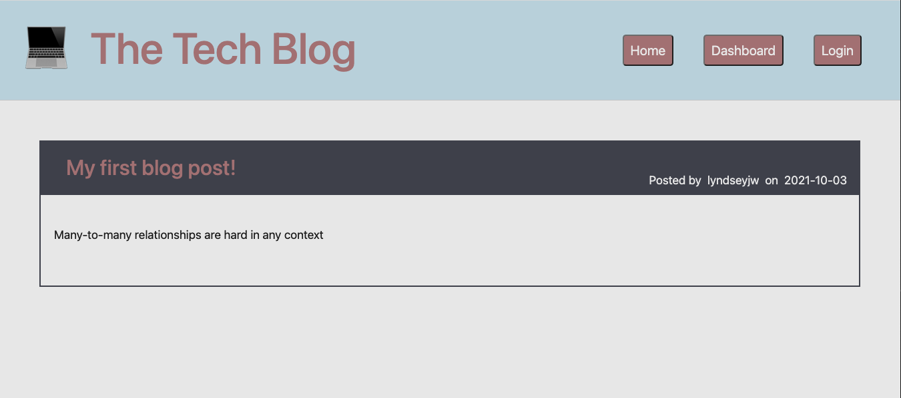
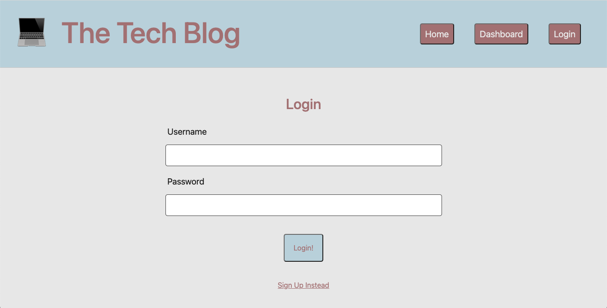
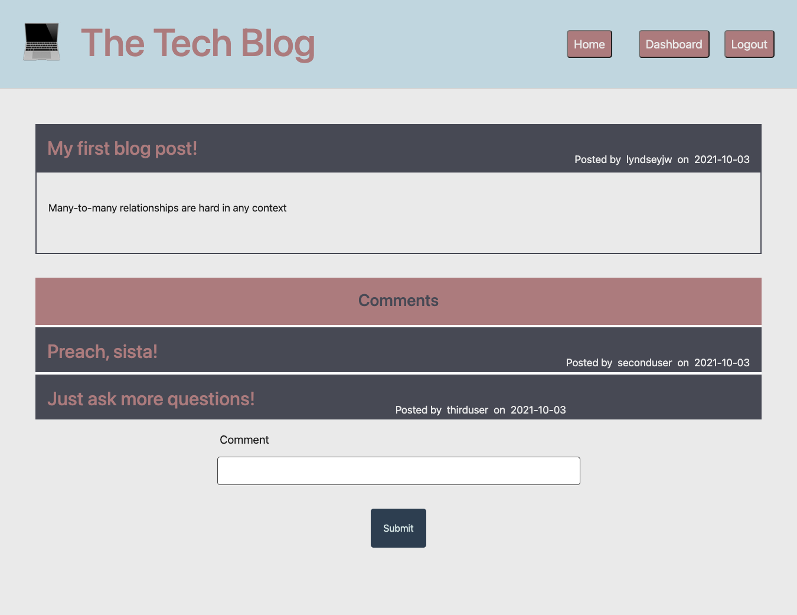

# tech-blog

## An MVC-Structured Blog Site for Developers to Share Technical Concepts, Recent Advancements &amp; New Technologies 

## Overview

This application was a wonderful challenge of my MVC knowledge. It really tested my ability to understand the logic & flow of a full stack web application. I realized my greatest strength is within frontend javascript. I absolutely love dynamically manipulating the DOM but found that this can cause quite a bit of confusion when the answer might simply be to render a new handlebars page. I had to swallow my pride & resist making complex frontend javascript files in order to make a concise MVC structure that would be user friendly & functional.

I had a lot of fun working on this despite many of the struggles as the end result was well worth all the effort. I appreciate the many (many, many) failures because they helped strengthen my de-bugging skills & eye for detail. Something as simple as misnaming a route can throw off the entire application & helped me implement strict 'singular noun' rules that I will carry throughout my career. 

This application supplies the user with every route (GET, DELETE, etc.), making this a fully dynamic, interactive UI & DB. The folders are also concise & organized in a way that any developer could easily come in & edit / update as necessary & without difficulty.

## Installation & Usage

Users can access the deployed application HERE : https://sheltered-journey-74962.herokuapp.com/
Once on the site, users can create a profile & once logged in, they are able to see other users' posts as well as their own + any comments their posts may have accumulated. Users can also add comments to other users' posts. A user can edit / delete their own blog posts as well. Happy blogging!

## Languages and Technologies Used

Handlebars, CSS, Javascript, Node, NPMs, Express, Sequelize, mySQL, Heroku, Restful-APIs, Session-Cookie

## License

This project is licensed under the terms of the MIT license. 

## Contributing

You may contact the sole contributor at lyndseyjwatson@gmail.com if you have any questions.

## Application Screenshots

Tech-Blog Homepage :

Login Page (all users must login OR sign up before they can see blogpost content, comment, create posts, etc.)

Dashboard (a user may see all previous posts along with comments from other users)

